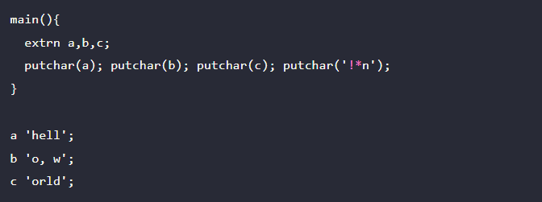
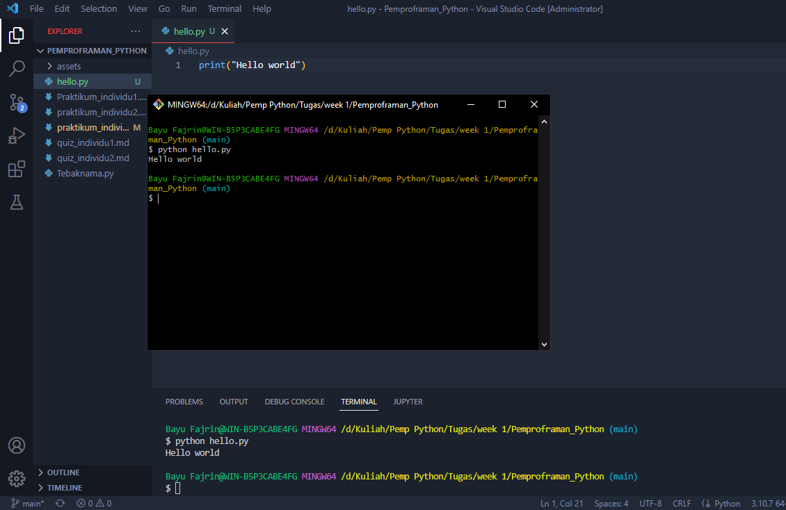
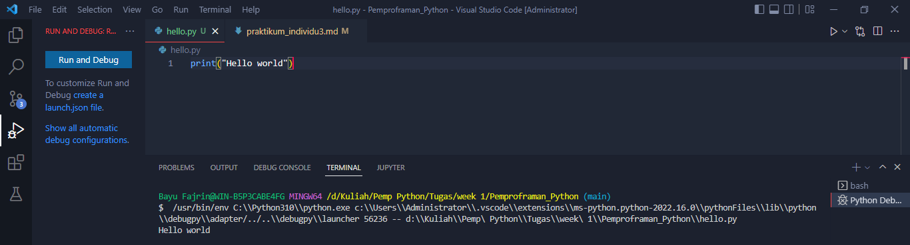

# praktikum individu 3

## 1. Tuliskan Sejarah kenapa kita pertama kali belajar programing language harus menggunakan “hello world”

Orang yang pertama kali menulis program Hello World adalah <b>Brian Kernighan</b> Ketika itu, beliau menulis dokumentasi untuk bahasa pemrograman BCPL (Basic Combined Programming Language) dan memberikan contoh program Hello World.

Berikut ini cuplikan kode program Hello World pertama dalam bahasa pemrograman BCPL.

Setelah bahasa pemrograman C dirilis, bahasa pemrograman BCPL selanjutnya dikenal dengan bahasa B.
Kadang bahasa BCPL dibuat menjadi bahan lelucon dengan merubah kepanjangan BCPL menjadi “Before C Programming Language” (Bahasa pemrograman Sebelum C).
Kenapa Harus Hello World?
Apakah Hello World dipakai karena Brian Kernighan terinspirasi dari anime HELLO WORLD?
Brian Kernighan sebenarnya tidak ingat betul, mengapa beliau menggunakan kata Hello World. Namun, berdasarkan wawancara Forbes India, beliau menyatakan:

<h3><i>Memory is dim now. What I do remember is that I had seen a cartoon that showed an egg and a chick and the chick was saying, “Hello, world” 4</i></h3>

Ingatan saya sangat suram sekarang. Apa yang saya ingat adalah sebuah kartun yang menampilkan seekor telur dan anak ayam, dan anak ayam itu mengatakan “Hello, world!”
selengkapnya di [Sejarah dan Asal Usul 'Hello World' yang Jarang diketahui Orang. By Petanicode.com](https://www.petanikode.com/hello-world/)

## 2. Jelaskan arti dari => `print()` pada PL Python.

`print()` Merupakan fungsi yang digunakan untuk mencetak ouput program di layar ataupun console.

## 3. Jelaskan arti dari => print(“Hello world”) pada PL Python.

`print(“Hello world”)` Merupakan fungsi yang digunakan untuk mencetak ouput berupa string dengan isi **Hello world** pada console.

## 4. Praktikkan cara eksekusi Eksekusi PL python pada

a. Pada terminal

b. Pada vs-code

