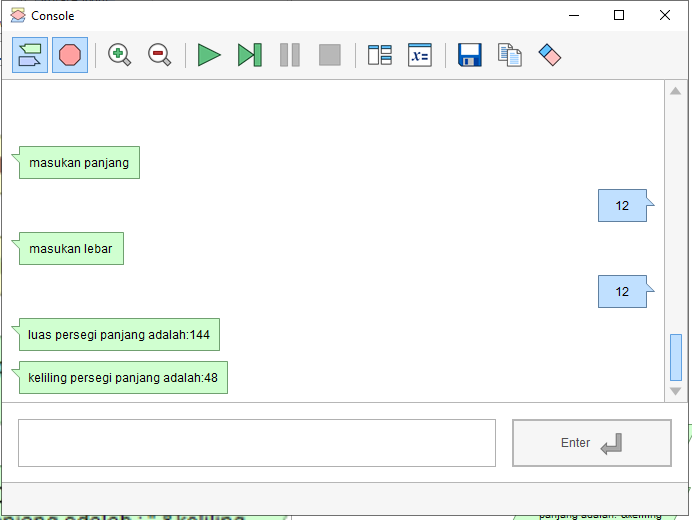
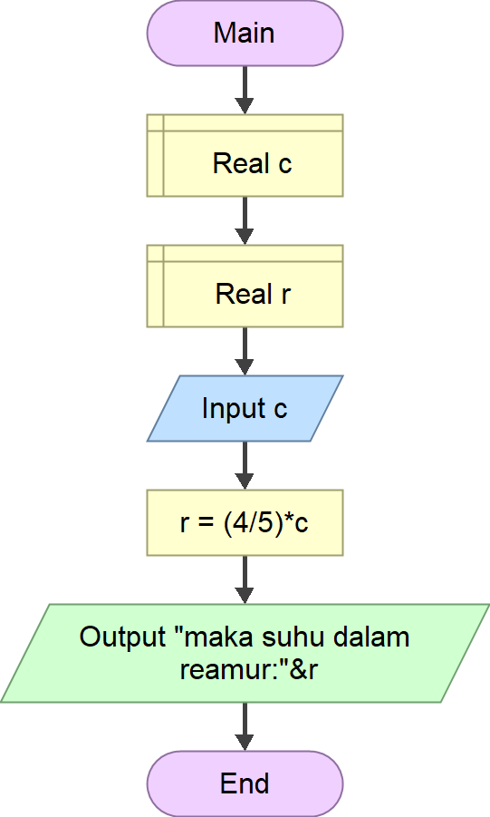

# Tugas individu 3

## 1. Flowchart menghitung Keliling dan Luas Persegi Panjang

### sc flowgorithm

### hasil setelah run

### setelah di ubah jadi pl python dan copy ke vscode

## 2.a Flowchart Konversi Suhu reamur ke celcius

### sc flowgorithm

### hasil setelah run

### setelah di ubah jadi pl python dan copy ke vscode

## 2.b Flowchart Konversi Suhu Fahrenheit ke calcius

### sc flowgorithm

### hasil setelah run

### setelah di ubah jadi pl python dan copy ke vscode

## 2.c Flowchart Konversi Suhu Celcius ke reamur

### sc flowgorithm

### hasil setelah run

### setelah di ubah jadi pl python dan copy ke vscode

## 2.d Flowchart Konversi Suhu Celcius ke Fahrenheit

### sc flowgorithm

### hasil setelah run

### setelah di ubah jadi pl python dan copy ke vscode

